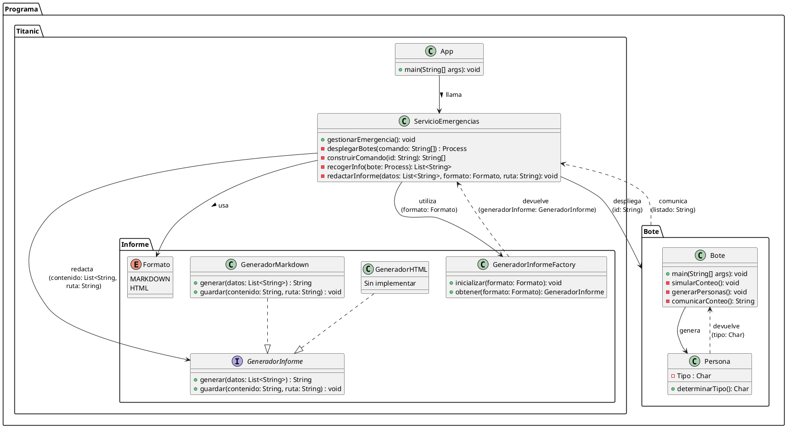

## 1. Titanic 
Programa realizado por **Luis Miguel López Romero**

## 2. Índice

## 3. Analisis del problema 
- Tenemos que simular la gestion de los botes salvavidas del titanic 

- Se nos pide crear un servicio de emergencias el cual se encarga de la emergencia, es decir es el encargado del depliege de los botes y tambien es el encargado de redactar el informe de las personas salvadas en cada bote y en total.

- Por otra parte cada bote se tendra que gestionar el solo y generara aleatoriamente un numero de personas del 1 al 100 que iran dentro de ese bote, dentro de ese numero tambien tendra que generar aleatoriamente entre mujeres, hombres y niños. 

- Cada bote tardara en contar a sus pasajeros un intervalo de 2 a 6 segundos despues le comunicara a el servicio de emergencia sus pasajeros

- Despues el servicio de emergencias se encargara de almacenar toda esa informacion y se encargara de redactar el informe en formato markdown, aun que se debe contemplar que un futuro pueden ser otros formatos.

## 4. Diseño de la solucion 

### 4.1 Diseño en lineas 

                                                                Programa
                                                                    - Titanic
                                                                    - Botes 
                                                                

                                Titanic                                                                 Botes 
                                    - App                                                                  - Bote 
                                    - Servicio Emergencias                                                 - Persona
                                    - Informes 

    Servicio Emergencias                     Informes                                        Bote                           Persona
       - Gestionar la emergencia               - Enumeracion con el Formato                   - Simular conteo               - Determinar si es hombre, 
       - Recoger info de los botes             - Generador de HTML                            - Generar personas               mujer o niño.
       - Mandar a redactar el informe          - Generador de Markdown                        - Comunicar conteo
       - Construir comando                     - Interfaz generador de informes 
       - Desplegar botes                       - Fabrica de generadore

### 4.2 Diseño en UML 

