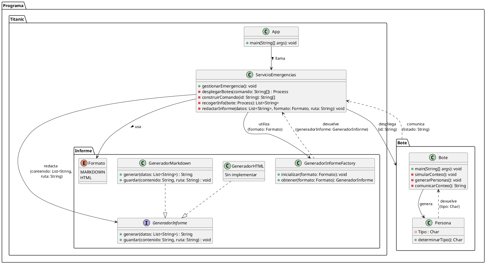

## 1. Titanic 
Programa realizado por **Luis Miguel López Romero**

---

## 2. Índice

---

## 3. Analisis del problema 
- Tenemos que simular la gestion de los botes salvavidas del titanic 

- Se nos pide crear un servicio de emergencias el cual se encarga de la emergencia, es decir es el encargado del depliege de los botes y tambien es el encargado de redactar el informe de las personas salvadas en cada bote y en total.

- Por otra parte cada bote se tendra que gestionar el solo y generara aleatoriamente un numero de personas del 1 al 100 que iran dentro de ese bote, dentro de ese numero tambien tendra que generar aleatoriamente entre mujeres, hombres y niños. 

- Cada bote tardara en contar a sus pasajeros un intervalo de 2 a 6 segundos despues le comunicara a el servicio de emergencia sus pasajeros

- Despues el servicio de emergencias se encargara de almacenar toda esa informacion y se encargara de redactar el informe en formato markdown, aun que se debe contemplar que un futuro pueden ser otros formatos.

---

## 4. Diseño de la solucion 

---

### 4.1 Diseño en lineas 

                                                                Programa
                                                                    - Titanic
                                                                    - Botes 
                                                                

                                Titanic                                                                 Botes 
                                    - App                                                                  - Bote 
                                    - Servicio Emergencias                                                 - Persona
                                    - Informes 

    Servicio Emergencias                     Informes                                        Bote                           Persona
       - Gestionar la emergencia               - Enumeracion con el Formato                   - Simular conteo               - Determinar si es hombre, 
       - Recoger info de los botes             - Generador de HTML                            - Generar personas               mujer o niño.
       - Mandar a redactar el informe          - Generador de Markdown                        - Comunicar conteo
       - Construir comando                     - Interfaz generador de informes 
       - Desplegar botes                       - Fabrica de generadore

---

### 4.2 Diseño en UML 

--- 

## 5. Plan de pruebas
En el plan de pruebas he probado `Bote.java` y `Persona.java`, para ello he usado mockito y JUnit5

---

## 6. Manual de usuario 
Ejecutar desde `App.java` y abrir el proyecto desde la raiz, osea desde Titanic.

Requisitos: 
- Maven 
- Java 17 o superior

Y usa Junit, Mockito y Lombock

---

## 7. Notas 

### 7.1 Elementos destacables del desarrollo
- Uso de procesos y su comunicacion entre si
- Uso de una fabrica de generadores de informes contemplando la futura exportacion a diferentes formatos
- Diseño hecho en UML 
- Test unitarios de algunas clases

### 7.2 Problemas encontrados
- El problema mas grande fue hacer el codigo antes que el diseño ya que al hacer el diseño me di cuenta de cosas que estaban mal y era un lio
    cambiar cosas ya con el codigo hecho.
- Problemas a la hora de hacer test. 
- Problemas a la hora de definir si algo es public, private o protected y si es static o no.

### 7.3 Conclusiones personales
A la siguiente hare el diseño y el analisis antes de codificar ya que hace que codificando no tengas casi que pensar. 
Y repasare Junit para hacer mejores test
